# DeepBoner Workflow - Simplified Magentic Architecture

> **Architecture Pattern**: Microsoft Magentic Orchestration
> **Design Philosophy**: Simple, dynamic, manager-driven coordination
> **Key Innovation**: Intelligent manager replaces rigid sequential phases

---

## 1. High-Level Magentic Workflow

```mermaid
flowchart TD
    Start([User Query]) --> Manager[Magentic Manager<br/>Plan • Select • Assess • Adapt]

    Manager -->|Plans| Task1[Task Decomposition]
    Task1 --> Manager

    Manager -->|Selects & Executes| HypAgent[Hypothesis Agent]
    Manager -->|Selects & Executes| SearchAgent[Search Agent]
    Manager -->|Selects & Executes| AnalysisAgent[Analysis Agent]
    Manager -->|Selects & Executes| ReportAgent[Report Agent]

    HypAgent -->|Results| Manager
    SearchAgent -->|Results| Manager
    AnalysisAgent -->|Results| Manager
    ReportAgent -->|Results| Manager

    Manager -->|Assesses Quality| Decision{Good Enough?}
    Decision -->|No - Refine| Manager
    Decision -->|No - Different Agent| Manager
    Decision -->|No - Stalled| Replan[Reset Plan]
    Replan --> Manager

    Decision -->|Yes| Synthesis[Synthesize Final Result]
    Synthesis --> Output([Research Report])

    style Start fill:#e1f5e1
    style Manager fill:#ffe6e6
    style HypAgent fill:#fff4e6
    style SearchAgent fill:#fff4e6
    style AnalysisAgent fill:#fff4e6
    style ReportAgent fill:#fff4e6
    style Decision fill:#ffd6d6
    style Synthesis fill:#d4edda
    style Output fill:#e1f5e1
```



## 2. Magentic Manager: The 6-Phase Cycle


## 3. Simplified Agent Architecture

```mermaid
graph TB
    subgraph "Orchestration Layer"
        Manager[Magentic Manager<br/>• Plans workflow<br/>• Selects agents<br/>• Assesses quality<br/>• Adapts strategy]
        SharedContext[(Shared Context<br/>• Hypotheses<br/>• Search Results<br/>• Analysis<br/>• Progress)]
        Manager <--> SharedContext
    end

    subgraph "Specialist Agents"
        HypAgent[Hypothesis Agent<br/>• Domain understanding<br/>• Hypothesis generation<br/>• Testability refinement]
        SearchAgent[Search Agent<br/>• Multi-source search<br/>• RAG retrieval<br/>• Result ranking]
        AnalysisAgent[Analysis Agent<br/>• Evidence extraction<br/>• Statistical analysis<br/>• Code execution]
        ReportAgent[Report Agent<br/>• Report assembly<br/>• Visualization<br/>• Citation formatting]
    end

    subgraph "MCP Tools"
        WebSearch[Web Search<br/>PubMed • arXiv • bioRxiv]
        CodeExec[Code Execution<br/>Sandboxed Python]
        RAG[RAG Retrieval<br/>Vector DB • Embeddings]
        Viz[Visualization<br/>Charts • Graphs]
    end

    Manager -->|Selects & Directs| HypAgent
    Manager -->|Selects & Directs| SearchAgent
    Manager -->|Selects & Directs| AnalysisAgent
    Manager -->|Selects & Directs| ReportAgent

    HypAgent --> SharedContext
    SearchAgent --> SharedContext
    AnalysisAgent --> SharedContext
    ReportAgent --> SharedContext

    SearchAgent --> WebSearch
    SearchAgent --> RAG
    AnalysisAgent --> CodeExec
    ReportAgent --> CodeExec
    ReportAgent --> Viz

    style Manager fill:#ffe6e6
    style SharedContext fill:#ffe6f0
    style HypAgent fill:#fff4e6
    style SearchAgent fill:#fff4e6
    style AnalysisAgent fill:#fff4e6
    style ReportAgent fill:#fff4e6
    style WebSearch fill:#e6f3ff
    style CodeExec fill:#e6f3ff
    style RAG fill:#e6f3ff
    style Viz fill:#e6f3ff
```



## 4. Dynamic Workflow Example

```mermaid
sequenceDiagram
    participant User
    participant Manager
    participant HypAgent
    participant SearchAgent
    participant AnalysisAgent
    participant ReportAgent

    User->>Manager: "Research protein folding in Alzheimer's"

    Note over Manager: PLAN: Generate hypotheses → Search → Analyze → Report

    Manager->>HypAgent: Generate 3 hypotheses
    HypAgent-->>Manager: Returns 3 hypotheses
    Note over Manager: ASSESS: Good quality, proceed

    Manager->>SearchAgent: Search literature for hypothesis 1
    SearchAgent-->>Manager: Returns 15 papers
    Note over Manager: ASSESS: Good results, continue

    Manager->>SearchAgent: Search for hypothesis 2
    SearchAgent-->>Manager: Only 2 papers found
    Note over Manager: ASSESS: Insufficient, refine search

    Manager->>SearchAgent: Refined query for hypothesis 2
    SearchAgent-->>Manager: Returns 12 papers
    Note over Manager: ASSESS: Better, proceed

    Manager->>AnalysisAgent: Analyze evidence for all hypotheses
    AnalysisAgent-->>Manager: Returns analysis with code
    Note over Manager: ASSESS: Complete, generate report

    Manager->>ReportAgent: Create comprehensive report
    ReportAgent-->>Manager: Returns formatted report
    Note over Manager: SYNTHESIZE: Combine all results

    Manager->>User: Final Research Report
```



## 5. Manager Decision Logic


## 6. Hypothesis Agent Workflow

```mermaid
flowchart LR
    Input[Research Query] --> Domain[Identify Domain<br/>& Key Concepts]
    Domain --> Context[Retrieve Background<br/>Knowledge]
    Context --> Generate[Generate 3-5<br/>Initial Hypotheses]
    Generate --> Refine[Refine for<br/>Testability]
    Refine --> Rank[Rank by<br/>Quality Score]
    Rank --> Output[Return Top<br/>Hypotheses]

    Output --> Struct[Hypothesis Structure:<br/>• Statement<br/>• Rationale<br/>• Testability Score<br/>• Data Requirements<br/>• Expected Outcomes]

    style Input fill:#e1f5e1
    style Output fill:#fff4e6
    style Struct fill:#e6f3ff
```



## 7. Search Agent Workflow


## 8. Analysis Agent Workflow

```mermaid
flowchart TD
    Input1[Hypotheses] --> Extract
    Input2[Search Results] --> Extract[Extract Evidence<br/>per Hypothesis]

    Extract --> Methods[Determine Analysis<br/>Methods Needed]

    Methods --> Branch{Requires<br/>Computation?}
    Branch -->|Yes| GenCode[Generate Python<br/>Analysis Code]
    Branch -->|No| Qual[Qualitative<br/>Synthesis]

    GenCode --> Execute[Execute Code<br/>via MCP Sandbox]
    Execute --> Interpret1[Interpret<br/>Results]
    Qual --> Interpret2[Interpret<br/>Findings]

    Interpret1 --> Synthesize[Synthesize Evidence<br/>Across Sources]
    Interpret2 --> Synthesize

    Synthesize --> Verdict[Determine Verdict<br/>per Hypothesis]
    Verdict --> Support[• Supported<br/>• Refuted<br/>• Inconclusive]
    Support --> Gaps[Identify Knowledge<br/>Gaps & Limitations]
    Gaps --> Output[Return Analysis<br/>Report]

    style Input1 fill:#fff4e6
    style Input2 fill:#e6f3ff
    style Execute fill:#ffe6e6
    style Output fill:#e6ffe6
```



## 9. Report Agent Workflow


## 10. Data Flow & Event Streaming

```mermaid
flowchart TD
    User[👤 User] -->|Research Query| UI[Gradio UI]
    UI -->|Submit| Manager[Magentic Manager]

    Manager -->|Event: Planning| UI
    Manager -->|Select Agent| HypAgent[Hypothesis Agent]
    HypAgent -->|Event: Delta/Message| UI
    HypAgent -->|Hypotheses| Context[(Shared Context)]

    Context -->|Retrieved by| Manager
    Manager -->|Select Agent| SearchAgent[Search Agent]
    SearchAgent -->|MCP Request| WebSearch[Web Search Tool]
    WebSearch -->|Results| SearchAgent
    SearchAgent -->|Event: Delta/Message| UI
    SearchAgent -->|Documents| Context
    SearchAgent -->|Embeddings| VectorDB[(Vector DB)]

    Context -->|Retrieved by| Manager
    Manager -->|Select Agent| AnalysisAgent[Analysis Agent]
    AnalysisAgent -->|MCP Request| CodeExec[Code Execution Tool]
    CodeExec -->|Results| AnalysisAgent
    AnalysisAgent -->|Event: Delta/Message| UI
    AnalysisAgent -->|Analysis| Context

    Context -->|Retrieved by| Manager
    Manager -->|Select Agent| ReportAgent[Report Agent]
    ReportAgent -->|MCP Request| CodeExec
    ReportAgent -->|Event: Delta/Message| UI
    ReportAgent -->|Report| Context

    Manager -->|Event: Final Result| UI
    UI -->|Display| User

    style User fill:#e1f5e1
    style UI fill:#e6f3ff
    style Manager fill:#ffe6e6
    style Context fill:#ffe6f0
    style VectorDB fill:#ffe6f0
    style WebSearch fill:#f0f0f0
    style CodeExec fill:#f0f0f0
```



## 11. MCP Tool Architecture

```mermaid
graph TB
    subgraph "Agent Layer"
        Manager[Magentic Manager]
        HypAgent[Hypothesis Agent]
        SearchAgent[Search Agent]
        AnalysisAgent[Analysis Agent]
        ReportAgent[Report Agent]
    end

    subgraph "MCP Protocol Layer"
        Registry[MCP Tool Registry<br/>• Discovers tools<br/>• Routes requests<br/>• Manages connections]
    end

    subgraph "MCP Servers"
        Server1[Web Search Server<br/>localhost:8001<br/>• PubMed<br/>• arXiv<br/>• bioRxiv]
        Server2[Code Execution Server<br/>localhost:8002<br/>• Sandboxed Python<br/>• Package management]
        Server3[RAG Server<br/>localhost:8003<br/>• Vector embeddings<br/>• Similarity search]
        Server4[Visualization Server<br/>localhost:8004<br/>• Chart generation<br/>• Plot rendering]
    end

    subgraph "External Services"
        PubMed[PubMed API]
        ArXiv[arXiv API]
        BioRxiv[bioRxiv API]
        Modal[Modal Sandbox]
        ChromaDB[(ChromaDB)]
    end

    SearchAgent -->|Request| Registry
    AnalysisAgent -->|Request| Registry
    ReportAgent -->|Request| Registry

    Registry --> Server1
    Registry --> Server2
    Registry --> Server3
    Registry --> Server4

    Server1 --> PubMed
    Server1 --> ArXiv
    Server1 --> BioRxiv
    Server2 --> Modal
    Server3 --> ChromaDB

    style Manager fill:#ffe6e6
    style Registry fill:#fff4e6
    style Server1 fill:#e6f3ff
    style Server2 fill:#e6f3ff
    style Server3 fill:#e6f3ff
    style Server4 fill:#e6f3ff
```



## 12. Progress Tracking & Stall Detection

```mermaid
stateDiagram-v2
    [*] --> Initialization: User Query

    Initialization --> Planning: Manager starts

    Planning --> AgentExecution: Select agent

    AgentExecution --> Assessment: Collect results

    Assessment --> QualityCheck: Evaluate output

    QualityCheck --> AgentExecution: Poor quality<br/>(retry < max_rounds)
    QualityCheck --> Planning: Poor quality<br/>(try different agent)
    QualityCheck --> NextAgent: Good quality<br/>(task incomplete)
    QualityCheck --> Synthesis: Good quality<br/>(task complete)

    NextAgent --> AgentExecution: Select next agent

    state StallDetection <<choice>>
    Assessment --> StallDetection: Check progress
    StallDetection --> Planning: No progress<br/>(stall count < max)
    StallDetection --> ErrorRecovery: No progress<br/>(max stalls reached)

    ErrorRecovery --> PartialReport: Generate partial results
    PartialReport --> [*]

    Synthesis --> FinalReport: Combine all outputs
    FinalReport --> [*]

    note right of QualityCheck
        Manager assesses:
        • Output completeness
        • Quality metrics
        • Progress made
    end note

    note right of StallDetection
        Stall = no new progress
        after agent execution
        Triggers plan reset
    end note
```



## 13. Gradio UI Integration

```mermaid
graph TD
    App[Gradio App<br/>DeepBoner Research Agent]

    App --> Input[Input Section]
    App --> Status[Status Section]
    App --> Output[Output Section]

    Input --> Query[Research Question<br/>Text Area]
    Input --> Controls[Controls]
    Controls --> MaxHyp[Max Hypotheses: 1-10]
    Controls --> MaxRounds[Max Rounds: 5-20]
    Controls --> Submit[Start Research Button]

    Status --> Log[Real-time Event Log<br/>• Manager planning<br/>• Agent selection<br/>• Execution updates<br/>• Quality assessment]
    Status --> Progress[Progress Tracker<br/>• Current agent<br/>• Round count<br/>• Stall count]

    Output --> Tabs[Tabbed Results]
    Tabs --> Tab1[Hypotheses Tab<br/>Generated hypotheses with scores]
    Tabs --> Tab2[Search Results Tab<br/>Papers & sources found]
    Tabs --> Tab3[Analysis Tab<br/>Evidence & verdicts]
    Tabs --> Tab4[Report Tab<br/>Final research report]
    Tab4 --> Download[Download Report<br/>MD / PDF / JSON]

    Submit -.->|Triggers| Workflow[Magentic Workflow]
    Workflow -.->|MagenticOrchestratorMessageEvent| Log
    Workflow -.->|MagenticAgentDeltaEvent| Log
    Workflow -.->|MagenticAgentMessageEvent| Log
    Workflow -.->|MagenticFinalResultEvent| Tab4

    style App fill:#e1f5e1
    style Input fill:#fff4e6
    style Status fill:#e6f3ff
    style Output fill:#e6ffe6
    style Workflow fill:#ffe6e6
```



## 14. Complete System Context


## 15. Workflow Timeline (Simplified)


---

## Key Differences from Original Design

| Aspect | Original (Judge-in-Loop) | New (Magentic) |
|--------|-------------------------|----------------|
| **Control Flow** | Fixed sequential phases | Dynamic agent selection |
| **Quality Control** | Separate Judge Agent | Manager assessment built-in |
| **Retry Logic** | Phase-level with feedback | Agent-level with adaptation |
| **Flexibility** | Rigid 4-phase pipeline | Adaptive workflow |
| **Complexity** | 5 agents (including Judge) | 4 agents (no Judge) |
| **Progress Tracking** | Manual state management | Built-in round/stall detection |
| **Agent Coordination** | Sequential handoff | Manager-driven dynamic selection |
| **Error Recovery** | Retry same phase | Try different agent or replan |

---

## Simplified Design Principles

1. **Manager is Intelligent**: LLM-powered manager handles planning, selection, and quality assessment
2. **No Separate Judge**: Manager's assessment phase replaces dedicated Judge Agent
3. **Dynamic Workflow**: Agents can be called multiple times in any order based on need
4. **Built-in Safety**: max_round_count (15) and max_stall_count (3) prevent infinite loops
5. **Event-Driven UI**: Real-time streaming updates to Gradio interface
6. **MCP-Powered Tools**: All external capabilities via Model Context Protocol
7. **Shared Context**: Centralized state accessible to all agents
8. **Progress Awareness**: Manager tracks what's been done and what's needed

---

## Legend

- 🔴 **Red/Pink**: Manager, orchestration, decision-making
- 🟡 **Yellow/Orange**: Specialist agents, processing
- 🔵 **Blue**: Data, tools, MCP services
- 🟣 **Purple/Pink**: Storage, databases, state
- 🟢 **Green**: User interactions, final outputs
- ⚪ **Gray**: External services, APIs

---

## Implementation Highlights

**Simple 4-Agent Setup:**
```python
workflow = (
    MagenticBuilder()
    .participants(
        hypothesis=HypothesisAgent(tools=[background_tool]),
        search=SearchAgent(tools=[web_search, rag_tool]),
        analysis=AnalysisAgent(tools=[code_execution]),
        report=ReportAgent(tools=[code_execution, visualization])
    )
    .with_standard_manager(
        chat_client=AnthropicClient(model="claude-sonnet-4"),
        max_round_count=15,    # Prevent infinite loops
        max_stall_count=3      # Detect stuck workflows
    )
    .build()
)
```

**Manager handles quality assessment in its instructions:**
- Checks hypothesis quality (testable, novel, clear)
- Validates search results (relevant, authoritative, recent)
- Assesses analysis soundness (methodology, evidence, conclusions)
- Ensures report completeness (all sections, proper citations)

No separate Judge Agent needed - manager does it all!

---

**Document Version**: 2.0 (Magentic Simplified)
**Last Updated**: 2025-11-24
**Architecture**: Microsoft Magentic Orchestration Pattern
**Agents**: 4 (Hypothesis, Search, Analysis, Report) + 1 Manager
**License**: MIT
